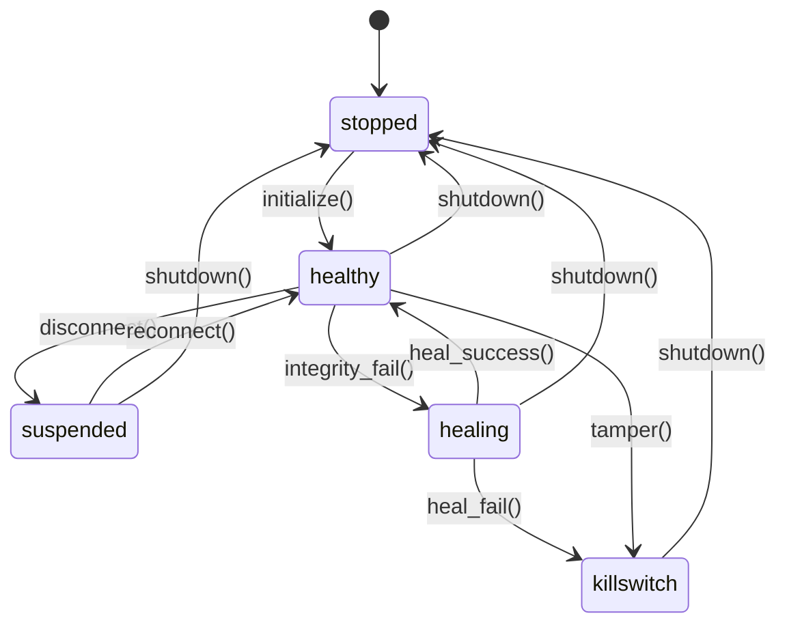
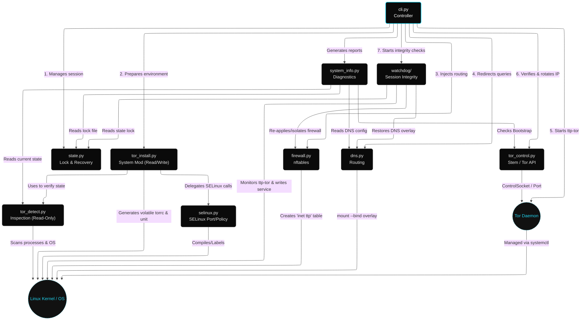

<!--
Copyright (c) 2026 onyks-os
SPDX-License-Identifier: MIT
-->

# TTP - Technical Architecture & Design

**MVP Language:** Python 3  

* **Target OS:** Any systemd-based Linux distribution *(Debian, Ubuntu, Fedora, Arch, etc.)*

---

## Table of Contents

1. [Project Goal](#1-project-goal)
2. [Module Architecture](#2-module-architecture)
3. [Module Details](#3-module-details)
4. [Command Line Interface](#4-command-line-interface)
5. [Dependencies](#5-dependencies)
6. [Project Structure](#6-project-structure)
7. [Branding & Assets](#7-branding--assets)
8. [Deployment & Installation Logic](#8-deployment--installation-logic)
9. [Packaging Pipeline](#9-packaging-pipeline)
10. [Development and Test Environment](#10-development-and-test-environment)
11. [Unit Tests - Specifications](#11-unit-tests--specifications)

**Related documents:**

* [interfaces.md](interfaces.md) — Full CLI, Tor, and system interface reference (OSPS-SA-02.01)
* [security-assessment.md](security-assessment.md) — STRIDE threat model and risk assessment (OSPS-SA-03.01)

---

## 1. Project Goal

**TTP (Transparent Tor Proxy)** is a CLI tool for Linux that intercepts all outgoing network traffic from a user and forces it through the Tor network, without requiring per-application manual configuration.

Unlike similar tools (TorGhost, Anonsurf), TTP is designed to:

* Work on any modern Linux distribution with systemd and nftables.
* Be **crash-safe**: the network state is always restored.
* Be readable and maintainable.
* Be distributable as native system packages (`.deb`, `.rpm`, `PKGBUILD`).

---

## 2. Module Architecture

The project is divided into independent Python modules. Each module has a single responsibility and can be tested in isolation.

| Module           | Area             | Responsibility                                                                   |
| :--------------- | :--------------- | :------------------------------------------------------------------------------- |
| `tor_detect.py`  | **Detection**    | Checks Tor presence, status, config, user, and SELinux state.                    |
| `tor_config.py`  | **Configuration**| Generates volatile `torrc` and manages Pluggable Transport mapping constants.     |
| `tor_service.py` | **Service**      | Manages volatile `systemd` ttp-tor service unit generation and lifecycle control. |
| `tor_install.py` | **Readiness**    | Verifies Tor readiness, enforces strict No Auto-Install policy, re-exports API. |
| `firewall/`      | **Firewall**     | Package generating and applying `nftables` rules (`builder`, `runner`, `emergency`). |
| `dns.py`         | **DNS**          | Manages DNS via Kernel-level `mount --bind` overlay.                             |
| `dns_resolved.py`| **DNS**          | Manages systemd-resolved DNS redirection and caching drop-in configs.            |
| `state.py`       | **State**        | Manages volatile lock file in `/run/ttp` and recovery logic (volatile).          |
| `ux.py`          | **UX**           | Manages one-time user engagement flags and persistent sentinels (persistent).    |
| `tor_control.py` | **Control**      | Encapsulates Tor interaction (Stem, Bootstrap, IP Check).                        |
| `system_info.py` | **Diagnostic**   | Gathers system state (torrc, rules, logs, OS detection) for debugging.           |
| `selinux.py`     | **SELinux**      | Compiles, installs/removes custom SELinux policy, and labels/unlabels custom ports. |
| `watchdog/`      | **Watchdog**     | Package managing session background watchdog, auto-healing (`integrity.py`, `inotify.py`), service configuration (`service.py`), and wall/desktop alerts (`alerts.py`). |
| `cli.py` / `commands/` | **Interface**    | Typer entry point orchestrator (`cli.py`) and command modules (`start`, `stop`, etc.). |

### 2.1 Execution Flow - `start`

1. **cli**: Verifies root execution.
2. **state**: Checks for existing/orphaned locks and verifies `tmpfs` free space (**pre-flight check**).
3. **detect**: Verifies Tor installation and config.
4. **install**: Checks Tor readiness via `tor_install.py`. Enforces strict **No Auto-Install policy** (if Tor or required Pluggable Transports are missing, displays distro package guidance and official doc URLs, then exits with code 0). Performs **SELinux optimization** on Fedora.
5. **firewall**: Generates and atomically applies rules in isolated `inet ttp` table via `ttp/firewall/`.
6. **dns**: Clears any stale overlays (idempotency guard), then modifies active interface DNS using `mount --bind` overlay on `/etc/resolv.conf`.
7. **state**: Initializes volatile runtime in `/run/ttp` and writes lock file.
8. **cli**: Waits for Tor bootstrap via ControlSocket, verifies IP.
9. **watchdog**: Starts the volatile systemd watchdog service (`ttp-watchdog.service`) if watchdog monitoring is enabled.
10. **cli**: Returns to the prompt.

### 2.1.1 BYOD Execution Flow - `start --external-daemon`

When started in Bring Your Own Daemon (BYOD) mode, TTP delegates Tor lifecycle management to the host OS and focuses strictly on routing/firewall interception:

1. **cli**: Checks for conflicting `--watchdog` option (raises fatal error if active).
2. **cli**: Performs **Passive Health Checks** to verify the external Tor daemon is listening on target TCP/UDP ports.
3. **cli**: Resolves the Tor process owner's numeric UID using a hierarchical resolution strategy:
   * Override via `--tor-uid`.
   * Parsing `/proc/net/tcp` and `/proc/net/tcp6` for socket owner of `transport_port` with state `0A` (TCP_LISTEN).
   * Checking for system users `tor` or `debian-tor` in `/etc/passwd`.
4. **firewall**: Generates and atomically applies rules using the resolved Tor UID via `ttp/firewall/`.
5. **dns**: Clears any stale overlays, then modifies active interface DNS using `mount --bind` overlay on `/etc/resolv.conf`.
6. **state**: Writes lock file storing `external_daemon=True`.
7. **cli**: Verifies Tor routing using local endpoints.

### 2.2 Execution Flow - `stop` / crash

> [!NOTE]  
> **Normal:** `ttp stop` -> stops the watchdog service (if active) -> resolves Tor UID -> applies **Teardown Lockdown** (injects temporary drop rule at the top of the firewall output filter chain) -> graceful Tor `SHUTDOWN` (skipped in BYOD mode) -> stops the Tor service (skipped in BYOD mode) -> applies **Active Socket Slaughter** (injects counter reject and TCP Reset rules at the top of the output chain) -> waits for a 1.5-second micro-delay (allowing pending local connections to abort) -> flushes Netfilter connection tracking table via `conntrack -F` -> restores firewall/DNS (flushing and deleting `inet ttp` table) -> deletes lock. This zero-leak sequence prevents any cleartext traffic from escaping while the proxy is shutting down.
>
> [!TIP]
> **Emergency Restore:** `ttp stop --restore-only` bypasses session checks and forces network cleanup. Useful if TTP crashed and the lock file was lost.
>
> [!WARNING]
> **Crash (SIGTERM/SIGINT):** Signal handler ensures restoration before shutdown.
>
> [!IMPORTANT]
> **Worst-case (kill -9):** Next `ttp start` detects orphaned lock and auto-restores.

### 2.3 Flow - `refresh`

Sends `NEWNYM` signal via Stem. Tor changes circuits. Traffic flows normally during the switch.

---

## 3. Module Details

### 3.1 `tor_detect.py`

Module functionality:

* Installed? (`shutil.which`)
* Running? (`pgrep -x tor`)
* Configured? (Checks `TransPort`, `DNSPort`, `ControlSocket`)
* User? (Live inspection `ps -eo user:32,comm` -> `/etc/passwd` -> fallback)
* SELinux? (Checks if OS is Fedora-family and if SELinux is `Enforcing`)
* **Firewalld?** (Detects if `firewalld` is active to warn about potential `nftables` conflicts).

### 3.2 `tor_install.py` / `tor_config.py` / `tor_service.py`

Orchestrates Tor readiness and native systemd service configuration. Enforces a strict **No Auto-Install policy**: TTP will never attempt or suggest automated package installation.

1. **`tor_install.py`**: Verifies Tor presence and required Pluggable Transport binaries. If missing, displays distro package guidance (`apt`, `dnf`, `pacman`, `zypper`), official Tor Project documentation links, and exits with status code `0`.
2. **SELinux Optimization**: If on Fedora and enforcing, compiles the custom SELinux policy on-the-fly via `selinux.py`. The policy source (`.te`) is stored as an internal package resource and accessed via `importlib.resources`.
3. **`tor_config.py`**: Generates a volatile `torrc` in `/run/tor/ttp/torrc`, appending `UseBridges 1`, `ClientTransportPlugin` executable paths, and target `Bridge` lines if configured.
4. **`tor_service.py`**: Writes a dedicated `ttp-tor.service` unit to `/run/systemd/system/` (volatile, evaporates on reboot) and manages start/stop/reload calls via `systemctl`.

### 3.3 `firewall/` Package

Generates rules applied atomically via `nft -f` into the dedicated `inet ttp` table. Structured into a specialized package:

* `builder.py`: Pure ruleset string generator (`_build_ruleset`, `_has_cgroup_bypass_support`).
* `runner.py`: Low-level `nft` execution engine (`apply_rules`, `destroy_rules`, temporary ruleset file management).
* `emergency.py`: Lockdown and killswitch mechanisms (`apply_teardown_lockdown`, `apply_active_socket_slaughter`, `apply_emergency_killswitch`).

**Design principles:**

1. **Stateless Logic**: No system-wide rule backups are performed. All modifications are isolated to the `ttp` table.
2. **Atomic Cleanup**: Restoration is performed via `nft destroy table inet ttp`, faster and safer than rule-by-rule deletion.
3. **Multi-Chain Architecture**: A NAT hook (`output`/`prerouting`) handles redirection to Tor ports; a filter hook (`filter_out`) implements the Kill-Switch, rejecting everything that is not explicitly allowed.
4. **Split Tunneling**: UIDs/GIDs are resolved via Python's `pwd`/`grp` libraries and injected as `meta skuid`/`meta skgid` rules — no shell interpolation.
5. **Emergency Killswitch**: `apply_emergency_killswitch()` replaces the table with a minimal drop-all configuration (loopback exempt), used by the watchdog on persistent integrity failure.
6. **Teardown Lockdown**: `apply_teardown_lockdown(tor_uid)` inserts a drop rule at the top of the `filter_out` chain to block all outbound traffic except loopback and the Tor UID. This prevents leaks during graceful circuit closing and Tor daemon termination.
7. **Active Socket Slaughter**: `apply_active_socket_slaughter()` injects temporary TCP Reset and standard reject rules in `filter_out` to actively terminate pending local sockets (causing ECONNREFUSED/RST) before lowering the firewall.

> For the complete chain structure, rule execution order, and external interface specification see [`interfaces.md § 3.1`](interfaces.md#31-nftables-firewall).

### 3.4 `dns.py`

Implements a **stateless overlay** by bind-mounting a volatile resolver file from `/run/ttp/resolv.conf` over `/etc/resolv.conf`.

**Design rationale:**

* **Non-destructive by design**: The original file is never modified on disk — the overlay is transparent to the OS and evaporates on reboot.
* **Idempotency guard**: Before applying, `/proc/mounts` is scanned to remove any stale layers from prior unclean exits, ensuring multiple invocations are safe.
* **Symlink safety**: The real path of `/etc/resolv.conf` is resolved before mounting (common issue on systemd-managed systems where it is a symlink to `systemd-resolved`).
* **DoH/DoT mitigation**: DoT is blocked at the firewall layer (`firewall.py`); well-known DoH resolver IPs are blocked on port 443 to trigger system fallback; other unlisted DoH is routed through Tor; and DoH canary domains are mapped to `0.0.0.0` in the generated `torrc` to disable browser-level DoH where supported.
* **Resolved Delegation**: Relies on `dns_resolved.py` to transparently manage configurations when `systemd-resolved` is active, keeping bind-mount and service-configuration layers decoupled.

> For mount source/target paths, teardown behavior, and the full attribute table see [`interfaces.md § 3.2`](interfaces.md#32-dns-subsystem).

### 3.5 `state.py`

Manages `/run/ttp/ttp.lock` (JSON) on a volatile `tmpfs` mount. This ensures that session state disappears on power loss, preventing stale lock issues. Contains PID, timestamps, and metadata. Detects orphaned sessions.

**Security Hardening**:

* **Directory Permissions**: The `/run/ttp` directory is created with `0700` permissions (restricted to owner/root) to prevent unprivileged local enumeration.
* **Lock File Permissions**: The `ttp.lock` file is written with `0600` permissions, securing sensitive bridge credentials and configuration parameters from local information disclosure.
* **PID Recycling Protection**: When checking for orphaned processes, `state.py` parses `/proc/{pid}/cmdline` to verify that the active PID still corresponds to a `ttp` process, mitigating TOCTOU issues.

Also handles the **tmpfs pre-flight check** (`check_tmpfs_space`) to ensure at least 5MB of RAM is free before starting, preventing `ENOSPC` crashes mid-setup. Persistent configurations (like UX flags) are delegated to `ux.py`.

### 3.6 `cli.py` & `ttp/commands/` (CLI Architecture)

Typer CLI acting as the primary orchestrator. It manages the **TTP Tor service lifecycle** via a dedicated `ttp-tor.service` unit, handling signals (`SIGINT`/`SIGTERM`) to ensure clean network restoration.

The command handlers are modularized within `ttp/commands/`:

* `start.py`: Orchestrates start steps, delegating to helper parsers (`_parse_bypass_users_groups`, `_parse_bridges`, `_resolve_external_tor_uid`).
* `stop_restart.py`: Handles session teardown (`stop`) and session regeneration (`restart`).
* `session.py`: Coordinates passive diagnostic checking (`status`, `check`, `check-leak`, `refresh`).
* `admin.py`: Handles logs extraction (`logs`), uninstallation (`uninstall`), and manual process bypass (`bypass`).

Helper functions are split into internal submodules:

* `_ports.py`: Port-probing and socket ownership check utilities.
* `_logging.py`: Structured logging and formatting setup.
* `_validation.py`: Input validators, system pre-flight checks, and Tor routing verifiers.
* `_common.py`: Holds shared state singletons and backward-compatible re-exports.

> For the full command reference, options, exit codes, and root-privilege requirements see [`interfaces.md § 1`](interfaces.md#1-command-line-interface-cli).

### 3.7 `tor_control.py`

Encapsulates all communication with the Tor daemon.

* Connects to Tor's ControlPort/ControlSocket.
* Monitors bootstrap progress.
* Requests new circuits via `Signal.NEWNYM`.
* Executes graceful teardown via `Signal.SHUTDOWN` to close circuits cryptographically before network restoration.
* Verifies exit IP via multiple endpoints for resilience (`check.torproject.org`, `ipify`, `ifconfig.me`).

### 3.8 `system_info.py`

Pure data gathering module, decoupled from UI.

* Reads `/etc/os-release`.
* Captures Tor service status via `systemctl status`.
* Greps active `torrc` settings.
* Captures `nft list ruleset`.
* Captures DNS state from `/etc/resolv.conf` overlay.
* Returns results as a flat dictionary for the CLI to render.

### 3.9 `watchdog/` Package

Implements continuous, proactive session monitoring and auto-healing features to ensure absolute traffic security. Organized as a formal Finite State Machine (FSM):

* **`fsm.py` (Watchdog FSM)**: Houses the `WatchdogFSM` class which defines the state machine graph using the `transitions` library. It contains FSM state variables and executes transition triggers (`initialize`, `disconnect`, `reconnect`, `integrity_fail`, `heal_success`, `heal_fail`, `tamper`, `shutdown`) and their corresponding callback handlers.
* **`service.py` (Volatile Service Daemon)**: Configures and writes a dynamic systemd service unit (`/run/systemd/system/ttp-watchdog.service`) that runs the command `ttp watchdog run`. Because it resides in `/run/`, it evaporates on system reboot.
* **`inotify.py` (Continuous Monitoring Loop)**: Runs the event-driven monitoring loop using raw ctypes-based Inotify on `/etc/resolv.conf` (monitoring both realpath and symlink target swapping using `IN_DONT_FOLLOW`) and Netlink sockets for firewall events. It delegates all state changes and resource lifecycle actions directly to the FSM.
* **`integrity.py` (Integrity Check)**: Performs modular DNS, firewall, and Tor connectivity checks.
* **`alerts.py` (Alerts & Killswitch)**: Implements unprivileged system-wide notifications (`wall` and `notify-send`) and the emergency fail-closed killswitch. Sanitizes messages to prevent terminal escape injections.

#### Watchdog FSM State Transitions

The FSM models the watchdog lifecycle deterministically to prevent race conditions during recovery or network disconnect events:

### 3.10 `selinux.py`

Handles security policies and dynamic labeling for system integration under SELinux (active in Enforcing mode on Fedora/RHEL):

* **Custom Tor Policy Module**: Compiles (`checkmodule` / `semodule_package`) and installs (`semodule -i`) the custom `ttp_tor_policy` to allow standard Tor processes to operate with TTP's customized features.
* **Dynamic Port Labeling**: Dynamically maps custom user-selected TransPort and DNSPort to `tor_port_t` on startup via `semanage port -a` (or modifies existing ones using `-m`), and unregisters them on teardown via `semanage port -d` to avoid system configuration pollution.

### 3.11 `ux.py`

Manages persistent user engagement features that must survive system reboots (unlike volatile locks in `state.py`). It is the owner of:

* Persistent sentinels in `/var/lib/ttp/` (e.g. `.starred_notified`).
* Dynamic CLI star solicitation prompts.

### 3.12 `dns_resolved.py`

Manages configurations specific to systemd-resolved:

* Checks service status actively via systemctl commands.
* Writes a volatile systemd-resolved drop-in resolver mapping (`/run/systemd/resolved.conf.d/ttp.conf`) containing local DNSPort mappings (IPv4 and IPv6).
* Restarts the systemd-resolved service and flushes the system DNS cache on both initialization and teardown.

### 3.13 Architecture Graph & Module Interactions

The entry point `ttp/cli.py` is a thin Typer orchestrator that delegates execution to isolated command modules in the `ttp/commands/` directory.

* **`cli.py`**: Initializes the root Typer app, defines global state callbacks (`--verbose`, `--quiet`, `--log-format`), and mounts all sub-commands.
* **`ttp/commands/`**: Contains specialized command handlers (`start.py`, `stop_restart.py`, `session.py`, `admin.py`, `watchdog.py`) mapping 1:1 to user intents.
* **`_common.py` / `lifecycle.py`**: Provide shared utilities and state management across all CLI commands.

---

## 4. Command Line Interface

The full CLI reference — all commands, options, exit codes, and privilege requirements — is maintained as the single authoritative source in:

**[`docs/interfaces.md § 1 — Command Line Interface`](interfaces.md#1-command-line-interface-cli)**

Duplicated inline lists are intentionally omitted here to avoid version skew.

---

## 5. Dependencies

| Library    | Source | Purpose                            |
| :--------- | :----- | :--------------------------------- |
| `stem`     | PyPI   | Tor daemon control via Socket/Port |
| `typer`    | PyPI   | CLI framework                      |
| `rich`     | PyPI   | Terminal styling                   |
| `tor`      | System | Tor daemon                         |
| `nftables` | System | Firewall backend                   |

---

## 6. Project Structure

*(See README.md for full tree. Uses standard `pyproject.toml` distribution).*

---

## 7. Branding & Assets

TTP follows a consistent visual identity to ensure professional representation across documentation and web-based platforms.

| Asset            | Path                              | Usage                                                     |
| :--------------- | :-------------------------------- | :-------------------------------------------------------- |
| **Project Logo** | `assets/icon.png`                 | Main branding, README header, and social previews.        |
| **Favicon Set**  | `assets/favicon/`                 | Icons for web documentation and browser-based interfaces. |
| **Web Manifest** | `assets/favicon/site.webmanifest` | PWA and mobile-friendly metadata.                         |

The brand color palette is primarily **Black (#000000)** and **Cyan (#22d3ee)**, reflecting the tool's focus on privacy and high-performance networking.

---

## 8. Deployment & Installation Logic

TTP supports multiple installation methods, ranked by their ability to handle system-level dependencies and security policies.

### 8.1 Hierarchy of Installation

1. **Native Packages (`.deb`, `.rpm`, `PKGBUILD`) [Recommended]**: The most robust method. The OS package manager handles `tor` and `nftables` installation and ensures that SELinux policies (on Fedora) are registered at the kernel level.
2. **Universal Source Script (`scripts/install.sh`)**: An "intelligent" installer that creates an isolated virtual environment in `/opt/ttp`. It detects the host OS and, if SELinux is *Enforcing*, it compiles the `ttp_tor_policy.te` policy module on the fly.
3. **Python Packaging (`pipx`, `pip`) [Fallback]**: Standard Python distribution. While convenient, this method cannot install system dependencies or compile SELinux policies.

### 8.2 PEP 668 & System Stability

Modern Linux distributions (Ubuntu 23.04+, Debian 12+) implement **PEP 668** (Externally Managed Environments), which blocks global `pip install`.

* TTP recommends using **pipx** for a clean, isolated Python-only install.
* Manual venv management is supported for advanced users.

### 8.3 The SELinux Factor

A key architectural feature is the **dynamic SELinux policy**. Because Tor is restricted by default on RHEL/Fedora, it cannot bind to ports like 9040 (TransPort) without specific permissions.

* The **Native RPM** and the **Source Installer** both handle this by compiling a type-enforcement file into a binary policy module.
* **pip/pipx** installations will likely fail on Fedora unless the user manually handles SELinux or sets it to *Permissive* mode.

### 8.4 Uninstallation Safety

Because TTP modifies core network settings (Firewall and DNS), uninstallation requires care.

* **Native packages** use `prerm` or `preun` scripts to ensure the network is restored before the code is removed.
* **Source uninstaller** (`scripts/uninstall.sh`) explicitly calls `ttp stop` and `restore-network.sh`.
* **pipx/pip** users must manually run `ttp stop` before removing the package, as the Python package manager has no hook to restore system state.

---

## 9. Packaging Pipeline

Building system packages is handled by scripts in the `packaging/` directory:

* `release.sh`: Orchestrates the full release: Python wheel/sdist build + `twine check`, cleanup of prior artifacts, `.deb` (via `build_deb.sh`), `.rpm` when `rpmbuild` is available (via `build_rpm.sh`), and `SHA256SUMS.txt` for the produced packages. Invoked by `make build`.
* Step 0 runs `python -m build` with `TMPDIR` set **only for that command** to a project-local `.build_tmp` directory on disk. That avoids heavy use of RAM-backed `/tmp` on memory-constrained machines. The variable is not exported to the rest of the script so downstream tools (for example `dpkg-deb` inside `build_deb.sh`) keep using the system default temporary directory.
* `build_deb.sh`: Generates a Debian archive.
* `build_rpm.sh`: Generates a Fedora RPM (requires `rpm-build`).
* `PKGBUILD`: Standard Arch build recipe.

---

## 10. Development and Test Environment

### QEMU VM Configuration

* **OS:** Debian 13 (Trixie) Netinstall
* **Network:** NAT + Host-Only (SSH)
* **Workflow:** Code on host -> `scripts/vm/send.sh` or `rsync` -> Test on VM via SSH.

### CI/CD Automation (Makefile)

TTP employs a `Makefile` in the root directory to provide a unified entry point for local CI/CD. This ensures atomicity and consistency across different developer environments.

* **`make test`**: Executes unit tests via `pytest` (Phase 1).
* **`make integration-<distro>`**: Orchestrates Docker-based system tests for a specific distribution (Phase 2).
* **`make verify`**: The mandatory pre-commit pipeline. It runs the full suite (Unit + all Integration tests).
* **`make build`**: Compiles native system packages (`.deb`, `.rpm`) using the logic in `packaging/`.
* **`make clean`**: Purges all temporary build artifacts, `__pycache__`, and compiled packages.
* **`make pypi` / `make testpypi`**: Automates the build and upload of Python wheels to PyPI/TestPyPI.

### Testing Strategy

| Phase | Environment      | Goal                           | Status                      |
| :---- | :--------------- | :----------------------------- | :-------------------------- |
| 1     | Unit (Host)      | pytest, fully mocked           | PASS                        |
| 2     | Integration      | Docker testing (`.test` files) | PASS (Debian, Arch, Fedora) |
| 3     | Portability (VM) | Debian 13, Ubuntu              | PASS                        |

---

## 11. Unit Tests — Specifications

*(Tests run without root, using `unittest.mock`)*

* **`test_tor_detect.py`**: Verifies dictionary output across varying torrc and process states.
* **`test_firewall.py`**: Asserts DNS redirect appears BEFORE LAN bypass (critical - gateway DNS leak prevention), BEFORE loopback accept, BEFORE TCP redirect. Verifies IPv6 drop (when unsupported) or redirection (when supported), DoT rejection, DoH IP-level blocking, bypass user/group (split tunneling) rule injection, emergency killswitch table application, and teardown lockdown rule construction/execution.
* **`test_dns.py`**: Asserts correct mount --bind overlay, stale mount cleanup, and lazy umount.
* **`test_state.py`**: Asserts lock creation, reading, and orphan detection.
* **`test_fsm.py`**: Verifies WatchdogFSM state machine transitions, triggers, and callback handlers under mock conditions.
* **`test_cli.py`**: Verifies command orchestration, option injection, UI flow, non-root OSError safety, stop command execution order (lockdown -> shutdown -> conntrack flush -> destroy), and conntrack handling when utility is missing.
* **`test_tor_control.py`**: Verifies Tor daemon interaction, IP checking logic, and circuit bootstrap/rotation.
* **`test_tor_install.py`**: Asserts correct PM selection, torrc generation (including DoH blocking mapping), and service management.
* **`test_watchdog.py`**: Verifies volatile systemd unit generation, watchdog start/stop flow (mocking systemctl commands), integrity check behavior under healthy/failing states, auto-healing routing for DNS/Firewall/Tor, emergency killswitch execution, and watchdog main loop iteration logic.
* **`test_nse_rules.py`**: Integration ruleset validation using `network-sandbox-engine`. Resolves dynamic topologies, constructs isolated namespaces, and executes Scapy packet sniffing on host virtual interfaces to assert absolute zero network leaks. (Requires root).
* **`chaos_monkey.py`**: Destructive stress testing utility. Injects random failures (Tor socket closure, resolver umounts, nftables flushes) and asserts watchdog recovery and fail-closed security. (Requires root).
