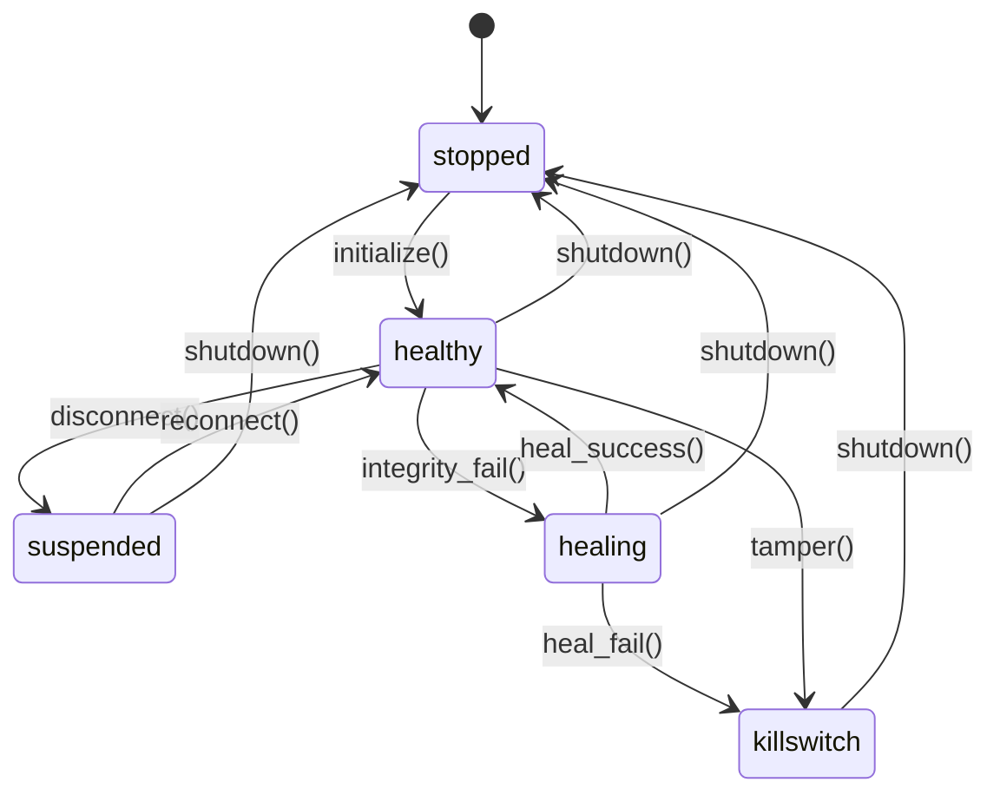

<!--
Copyright (c) 2026 onyks-os
# SPDX-License-Identifier: MIT
-->

# ADR 0010: Watchdog FSM (Finite State Machine)

## Status

Accepted (v0.4.7)

## Context

The TTP watchdog daemon manages session integrity and auto-healing. Originally, the watchdog ran in a nested, procedural `while True` loop inside `inotify.py`. While functional, this procedural approach:

1. Compounded state complexity, making it difficult to trace or reason about nested failure recovery paths (e.g. recovering from network disconnects while healing Tor).
2. Made unit testing and fuzzing of state transitions (such as simulated healing failures or lock-file tampering) extremely difficult without complex mock stacking.
3. Obscured state tracking, rendering the logs difficult to parse for automated diagnostic audits.

## Decision

To ensure high-assurance reliability and complete testability, we migrate the watchdog logic to a formal **Finite State Machine (FSM)** using the `transitions` library.

The machine is defined as follows:

### 1. States

* **`stopped`**: Watchdog is inactive (idle).
* **`healthy`**: Active monitoring. Tor, firewall, systemd-resolved, and DNS overlay are running correctly.
* **`suspended`**: Network link is offline or default gateway is missing. Integrity checks are paused.
* **`healing`**: An integrity check has failed. Auto-healing (restarting services) is active.
* **`killswitch`**: Healing failed or critical tampering detected. Emergency total-network-lockdown is active.

### 2. State Transition Model

All monitoring events, disconnections, and recoveries map to formal triggers:

### 3. Separation of Concerns

* **State Machine (`fsm.py`)**: Houses the FSM graph, state variable attributes (watches, sockets), and trigger actions (setup inotify, trigger auto-healing, trigger killswitch).
* **Event Loop (`inotify.py`)**: Multiplexes Netlink sockets and Inotify events via `select.select`, delegating all state transitions and system callbacks to the FSM.

## Consequences

* **Pros**:
  * **100% Transition Testability**: FSM states, transition pathways, and callbacks can be fuzzed and verified in isolated unit tests (`test_fsm.py`) without requiring root access or live sockets.
  * **Deterministic Behavior**: Illegal transition requests (e.g. trying to heal when suspended) are blocked at the FSM boundary and raise explicit `MachineError` exceptions.
  * **Improved Observability**: State changes are cleanly logged, making the system's runtime behavior transparent to system administrators.
* **Cons**:
  * Adds `transitions` as a runtime library dependency in `pyproject.toml`.
