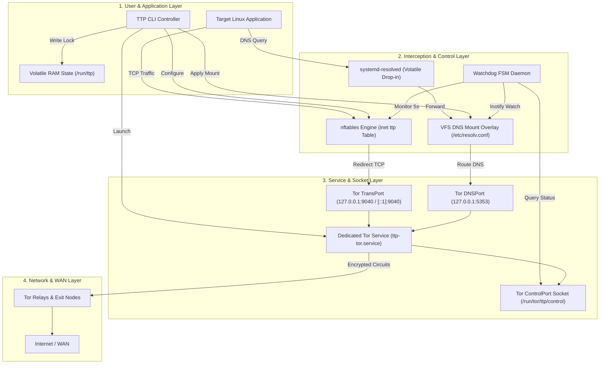

# Explanation: System Architecture and Execution Flow

TTP transparently routes all system TCP traffic and DNS queries through the Tor network by orchestrating Linux kernel subsystems, system utilities, and Tor control interfaces without modifying persistent host configurations.

---

## 1. System Layer Diagram



---

## 2. Kernel Network Pipeline (`nftables` Interception)

Network interception is executed atomically via a dedicated `nftables` table named `inet ttp`. The table defines three primary netfilter chains:

```text
table inet ttp {
    chain prerouting {
        type filter hook prerouting priority dstnat; policy accept;
        iifname != "lo" meta l4proto tcp redirect to :9040
    }

    chain output {
        type route hook output priority mangle; policy accept;
        skuid "ttp-tor" accept
        skuid "clearnet-user" accept
        skgid "bypass-group" accept
        oifname "lo" accept
        udp dport 53 redirect to :5353
        tcp dport 53 redirect to :5353
        meta l4proto tcp redirect to :9040
    }

    chain filter_out {
        type filter hook output priority filter; policy accept;
        udp dport 443 drop
        tcp dport 853 drop
        udp dport 853 drop
        ip6 nexthdr != { icmpv6 } drop
    }
}
```

### Packet Routing Logic

1. **UID/GID Exemption**: Packets originating from `ttp-tor` (Tor daemon UID), designated bypass users (`--bypass-user`), or bypass groups (`--bypass-group`) are accepted without redirection.
2. **DNS Interception**: Outbound UDP and TCP port 53 traffic is redirected to Tor DNSPort (`127.0.0.1:5353`).
3. **TCP Redirection**: All remaining outbound TCP connections are redirected to Tor TransPort (`127.0.0.1:9040` for IPv4, `[::1]:9040` for IPv6).
4. **Hard Interception Rules (`filter_out`)**:
   - **QUIC / UDP 443 Drop**: Drops UDP port 443 packets to prevent browsers from using HTTP/3 QUIC, forcing fallback to TCP (which Tor proxies).
   - **DoT Drop**: Drops TCP and UDP port 853 to prevent DNS-over-TLS bypass.
   - **DoH Resolver Blocks**: Drops traffic destined for known public DNS-over-HTTPS resolver IP addresses.
   - **IPv6 Enforcement**: When `--no-ipv6` is enabled, all non-ICMPv6 outbound IPv6 packets are dropped at the output hook.

---

## 3. Stateless DNS Overlay Subsystem

System DNS resolution is isolated through a dual-mechanism approach:

### VFS Bind-Mount Overlay

TTP creates a temporary RAM-backed `resolv.conf` file containing `nameserver 127.0.0.1` and overlays `/etc/resolv.conf` using a VFS kernel bind-mount (`mount --bind`).

- **Disk Integrity**: The physical `/etc/resolv.conf` file on host storage is untouched.
- **Teardown**: Upon session termination, `umount -l /etc/resolv.conf` unmounts the overlay instantly.

### `systemd-resolved` Volatile Integration

If `systemd-resolved` is active, TTP writes a volatile drop-in configuration at `/run/systemd/resolved.conf.d/ttp.conf` setting `DNS=127.0.0.1:5353` and `Domains=~.` before issuing a reload signal. This prevents `systemd-resolved` from querying upstream ISP resolvers.

---

## 4. Volatile Storage and Memory Layout

TTP enforces a strict zero-disk residue design policy. All operational data is stored in `tmpfs` RAM filesystems:

| Path | Storage Type | Purpose |
|---|---|---|
| `/run/ttp/ttp.lock` | `tmpfs` | Atomic session lockfile containing active parameters. |
| `/run/ttp/ttp.log` | `tmpfs` | Volatile session log buffer. |
| `/run/tor/ttp/torrc` | `tmpfs` | Generated Tor daemon runtime configuration. |
| `/run/tor/ttp/control` | `tmpfs` | Unix domain socket for Tor ControlPort. |

Because all state resides under `/run`, any abrupt power loss or hard reboot automatically purges all runtime artifacts without manual intervention.
