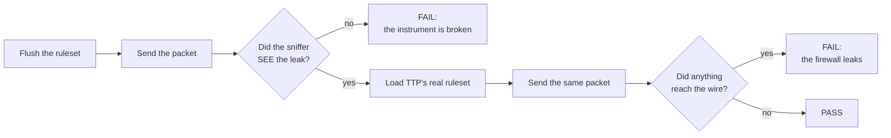

<!--
Copyright (c) 2026 onyks-os
SPDX-License-Identifier: MIT
-->

# Explanation: How the zero-leak claim is verified

TTP's central claim is that no cleartext packet reaches the WAN. This page is
about why you should believe it, and about the mistake that made an earlier
version of that evidence worth nothing.

---

## The problem with testing for an absence

The obvious test is:

```python
captured = sniffer.stop()
assert [p for p in captured if is_leak(p)] == []
```

That assertion is true when the firewall works. It is *also* true when the
sniffer never started, when the interface name is wrong, when the BPF filter
excludes the traffic, and when the stimulus never left the process. Four wrong
reasons, one right one, and nothing in the output distinguishes them.

For most of this project's life, that was the whole of the zero-leak suite - and
it was worse than that, because nothing executed it: no make target, no CI job,
no step in the release pipeline. A claim that nothing runs is not a measurement.

## What the suite does now

Every containment test runs its stimulus **twice**.



The first half is the **positive control**. It proves, on this machine, in this
run, for this exact traffic, that the harness can detect a leak. Only then is the
absence of one meaningful. If the control fails, the test fails there - it never
reaches the assertion that would have passed for the wrong reason.

## What is covered

Each of these is a path by which a transparent proxy is known to leak:

| Stimulus | What it proves |
| :--- | :--- |
| UDP DNS to a public resolver | plain DNS is redirected to Tor's DNSPort |
| TCP DNS (port 53) | the other DNS path, redirected separately |
| TCP to a web port | ordinary traffic reaches Tor's TransPort |
| DoT (TCP 853) | rejected outright rather than proxied |
| QUIC DoH (UDP 443) | the gap NAT cannot close - only the filter rule stops it |
| ICMP | Tor cannot carry it, so it must be rejected |
| Arbitrary UDP | the catch-all reject holds |
| IPv6 | the classic leak path when a proxy only reasons about IPv4 |

And one assertion in the other direction:

| Stimulus | What it proves |
| :--- | :--- |
| UDP from a bypassed UID to the LAN | TTP is a proxy, not a brick |

That last row matters more than it looks. A firewall that dropped every packet
would pass all eight containment tests. Without a test that something is *still
allowed*, "zero leaks" and "zero connectivity" are indistinguishable.

## Where it runs

The rules are loaded into an ephemeral Linux network namespace built by the
[Network Sandbox Engine](https://github.com/onyks-os/NetworkSandboxEngine), with
a Scapy sniffer on the boundary `veth`. The ruleset under test is the **real
generated one**, captured from TTP's own builder rather than written by hand for
the test - so a change to rule generation is visible here.

```bash
sudo apt install nftables iproute2 conntrack libpcap0.8 libpcap-dev
pip install -e ".[nse]"
make test-nse
```

`make test-nse` sets `TTP_REQUIRE_NSE=1`, which turns a missing, shadowed or
too-old engine into a hard error instead of a skip. A gate that can skip itself
is not a gate, and `nse` is a short import name that an unrelated PyPI package
can shadow - which looks exactly like "not installed".

The suite runs in CI on every push, and as a step in `scripts/verify.sh` before
a release.

## The dependency, and why it is pinned hard

`network-sandbox-engine>=2.1.0,<3`. The floor is not a preference.

Before 2.1.0 the engine's own test runner reported PASSED when its oracle had
observed nothing, and its kernel trace monitor could stop reading mid-run without
saying so. A green result from such an engine would not have been evidence of
anything - the same defect as the one described at the top of this page, one
layer down. TTP refuses to run this suite against an older engine rather than
produce a reassuring number.

See [ADR 0007](https://github.com/onyks-os/TransparentTorProxy/blob/main/docs/decisions/0007-ruleset-testing-with-nse.md)
for the decision record and its amendment.

## The rule, generalised

> A test that asserts an absence must first demonstrate it can detect a presence.

It applies well beyond firewalls. Any check for the non-occurrence of something -
no error logged, no file written, no request sent - has the same failure mode,
and needs the same paired control.
