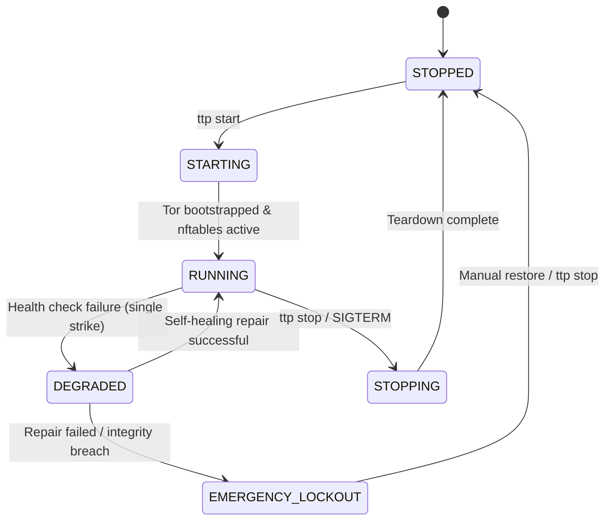

# Explanation: Watchdog Finite State Machine (FSM)

The TTP Watchdog is an active background daemon governed by a formal Finite State Machine (FSM) implemented via the Python `transitions` library. It monitors process health, network table integrity, and DNS mounts in real time to prevent accidental unproxied leaks.

---

## 1. FSM State Diagram



---

## 2. FSM State Definitions

| State | Description | Behavior & Invariants |
|---|---|---|
| `STOPPED` | Session is inactive. | Network operates in standard ISP mode; `inet ttp` table is absent. |
| `STARTING` | Initialization phase. | Launches `ttp-tor.service`, creates `/run/ttp` locks, builds `nftables` ruleset. |
| `RUNNING` | Session fully active. | Background watchdog monitors system health every 5 seconds. |
| `DEGRADED` | Non-critical fault detected. | Self-healing mechanism attempts to restore missing `nftables` chains or DNS mounts. |
| `EMERGENCY_LOCKOUT` | Critical failure / breach. | Engages fail-closed killswitch; drops all physical outbound traffic. |
| `STOPPING` | Teardown phase. | Restores `systemd-resolved`, unmounts `/etc/resolv.conf`, flushes `nftables` tables. |

---

## 3. Real-Time Integrity Probes

Every 5 seconds, the watchdog daemon executes 3 independent integrity checks:

### 1. Tor Process and Control Socket Verification

Asserts that `ttp-tor.service` (or the system Tor PID) is active and that the ControlPort socket `/run/tor/ttp/control` responds to `GETINFO status/circuit-established`.

### 2. Kernel `nftables` Ruleset Verification

Executes netfilter atomic queries asserting that the `inet ttp` table, `output` chain, and `filter_out` chain are loaded in the kernel. If another process or `firewalld` reload flushes the table, the watchdog transitions to `DEGRADED` and re-applies the ruleset.

### 3. Inotify Double-Watch DNS Overlay Verification

Monitors `/etc/resolv.conf` using Linux `inotify`:

* **Symlink Target Watch**: Detects external modifications to `/etc/resolv.conf` target path.
* **VFS Mount Point Watch**: Asserts that the active mount overlay (`mountpoint -q /etc/resolv.conf`) remains mounted.

---

## 4. Emergency Lockout (Fail-Closed Killswitch)

If self-healing fails while in `DEGRADED` state, or if an unrecoverable breach is detected, the watchdog executes `apply_emergency_killswitch()`:

```text
table inet ttp {
    chain output {
        type filter hook output priority filter; policy drop;
        oifname "lo" accept
    }
}
```

This immediately drops all outbound TCP, UDP, and ICMP traffic across all physical network interfaces while preserving local loopback communication (`lo`). The system remains locked down until the administrator executes `sudo ttp stop` or `sudo ttp purge`.
